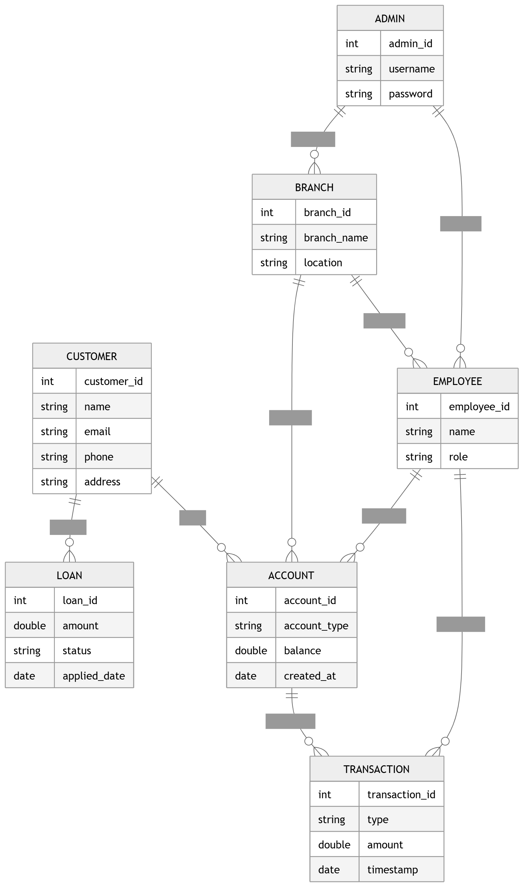

Got it — you want the **same SRS format with image links (not diagrams or images generated)**. Here is your **Bank Management System SRS in exact style**:

---

# 🏦 Software Requirements Specification (SRS)

## Bank Management System

---

## Preface

This document provides the Software Requirements Specification (SRS) for the **Bank Management System (BMS)**. It defines the system’s functionalities, performance criteria, security requirements, and overall system architecture necessary for development.

---

## Version History

* **Version 1.0** – Initial Draft.
* **Version 1.1** – Added non-functional requirements and system models.
* **Version 1.2** – Refined system evolution and glossary.

---

## 1. Introduction

### Purpose

The Bank Management System is a web-based application designed to manage banking operations such as account creation, deposits, withdrawals, fund transfers, loan management, and customer record handling in a secure and efficient way.

---

### Document Conventions

* **Must** – Mandatory requirement
* **Should** – Recommended feature
* **May** – Optional feature

---

### Intended Audience and Reading Suggestions

* Bank Administrators
* Software Developers
* QA/Test Engineers
* Stakeholders

---

### Scope

The system provides:

* Account management
* Transaction processing
* Loan management
* Customer and employee management
* Reporting and analytics
* Secure authentication system

---

### References

* IEEE SRS Standard 830-1998
* Database Design Principles
* Banking System Requirement Analysis

---

## 2. Overall Description

### Product Perspective

The Bank Management System is a centralized web-based banking platform that manages all banking operations using a secure database system.

---

### Product Functions

* Account creation and management
* Deposit, withdrawal, and transfer system
* Loan application and approval system
* Transaction history tracking
* User role management
* Report generation

---

### User Classes and Characteristics

* **Admin:** Full control over system and users
* **Employee:** Handles banking operations
* **Customer:** Uses banking services

---

### Operating Environment

* Web-based system (Chrome, Firefox, Edge)
* Backend: Java / PHP / Node.js
* Database: MySQL / PostgreSQL
* Cloud or local server

---

### Design and Implementation Constraints

* Must follow banking security standards
* Encrypted data storage required
* High availability system required

---

### Assumptions and Dependencies

* Internet connection required
* SMS/Email notification services may be used
* Third-party payment integration may be added later

---

## 3. System Requirements Specification

---

### Functional Requirements

#### User Authentication

* System must allow login and registration
* Role-based access (Admin, Employee, Customer) must be enforced
* Password recovery must be available

---

#### Account Management

* Customers must be able to create accounts
* Employees/Admin must manage accounts
* Accounts can be updated or closed

---

#### Transaction Management

* System must support deposit and withdrawal
* System must support fund transfers
* Transaction history must be stored

---

#### Loan Management

* Customers must apply for loans
* Admin must approve/reject loans
* Loan status must be trackable

---

#### Reporting

* Admin must generate financial reports
* Reports must be exportable (PDF/CSV)

---

### Non-Functional Requirements

---

#### Performance

* System must support 1000+ users
* Transactions must process within 2–3 seconds

---

#### Security

* Role-based authentication required
* Data encryption must be implemented
* Secure login system required

---

#### Usability

* User-friendly interface required
* Responsive design required

---

#### Reliability

* 99.9% uptime required
* Backup and recovery system required

---

#### Maintainability

* Modular design required
* Logging system must be implemented

---

#### Portability

* Works on Windows, Linux, Mac
* Cloud deployment supported

---

## 4. System Models

---

> **Context Diagram**

> **Entity Relationship Diagram**

## 5. System Evolution

### Assumptions

* AI-based fraud detection may be added
* Mobile banking app may be developed
* Payment gateway integration may be included

---

### Expected Changes

* Online payment system integration
* Biometric authentication
* AI-based transaction monitoring

---

## 6. Appendices

### Hardware Requirements

* Cloud server infrastructure
* Secure database server
* Load balanced backend

---

### Database Requirements

* Relational database system
* ACID transaction support
* Backup and recovery system

If you want, I can next:

* Convert these into **Word (.docx) file**
* Or make **proper UML diagram files (draw.io format)**
* Or create **presentation slides (PPT)**
